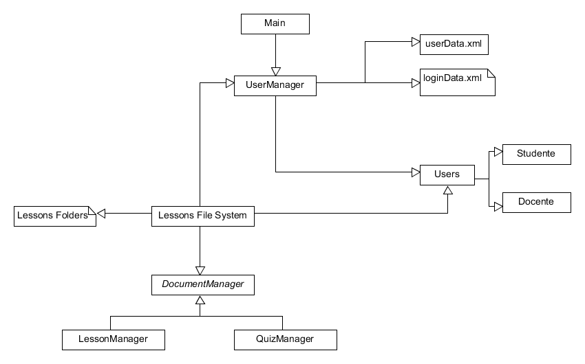

# Architecture and Design

## Lezioni alla pari
January dd, 2020

## Team Members
Ovidiu Andrioaia  
David Cirdan  
Luciano Mateias  
Zhiyang Xia


## Document Control
**Change History**

| Revision | Change Date | Description of changes |
| -------- | ----------- | ---------------------- |
| V1.0     | mm/dd/2020  | Initial release        |

**Document storage**

This document is stored in the project's GIT repository at:
https://github.com/KilliKrate/Software-Documentation-G6/blob/master/docs/Architecture%20and%20Design.md
 
**Document Owner**

Group 6 is responsible for developing and maintaining this document.

## Table of contents
> [Introduction](#introduction)
>
> [Data Flow Diagram](#data-flow-diagram)
>
> [TBD](#tbd)
>
> [High Level Hierarchy](#high-level-hierarchy)
>> [Hierarchy Diagram](#hierarchy-diagram)
>>
>> [Hierarchy Description](#hierarchy-description)
>
> [Components Classification](#components-classification)
>> [Presentation Layer](#presentation-layer)
>>
>> [Controller Layer](#controller-layer)
>>
>> [Business Layer](#business-layer)
>>
>> [Data Access Layer](#data-access-layer)
>>
>> [Record Layer](#record-layer)
>>
>> [Database Layer](#database-layer)
>
> [Process View](#process-view)
>> [Process View Description](#process-view-description)
>>
>> [Application View](#application-view)
>>
>> [Presentation View](#presentation-view)
>>
>> [User Management View](#user-management-view)
>

## Introduction

The Lezioni alla Pari Architecture Document is designed to illustrate and identify the high level architecture used to design and implement the Lezioni alla Pari application. The document contains an overall view of the system hierarchy, logical views of the system components, and a process view of the system's communication.

## Data Flow Diagram


## TBD



## High Level Hierarchy

### Hierarchy Diagram


### Hierarchy Description

The architecture system for the Lezioni alla Pari apllication is an n-tier application.

## Components Classification

### Presentation Layer

**Purpose**: To display forms, controls, images, videos to the user to create fluid and efficient user experience.

**Specific Nature**: The presentation layer will be in charge of displaying appropriate images, menus and videos to the user. This layer will also be in charge of handling stylus click. When a user clicks a menu on the GUI, the code corresponding to that event will be called. This layer will also be in charge of the spawning of appropriate threads. The need of spawning extra threads is due to the fact that the main thread of the app will be watching for event clicks, but we also need another thread constantly running to send asynchronous requests to the webserver.

**Subcomponents**: Image Viewer, Video Player

### Controller Layer

**Purpose**: Processes and respond to events, typically user actions, and may invoke changes on the model.

**Specific Nature**:

**Subcomponents**:

### Business Layer

**Purpose**:

**Specific Nature**:

**Subcomponents**:

### Data Access Layer

**Purpose**:

**Specific Nature**:

**Subcomponents**:

### Record Layer

**Purpose**:

**Specific Nature**:

**Subcomponents**:

### Database Layer

**Purpose**:

**Specific Nature**:

**Subcomponents**:

## Process View

### Process View Description

The Process View is essential in understanding how the separate components and subcomponents communicate with each other in a concurrent application. By better understanding the necessary paths of communication between the components, it may be possible to optimize the data flow and storage of the application, as well as ensuring thread-safety.

### Application View

This thread is the main application thread that is created at runtime of the program. The program creates the thread; this is not a user created thread. This thread handles the basic program flow by controlling navigation between items, videos, quizzes, including the handling of user input to the graphical forms.

### Presentation View

This view is user created, when the application enters the Course/Topic/Lesson management mode. This view is the main one, responsible for almost every action in the application. From this view an authorized user, based on its permissions, can create an item on the platform and give read and write access to other users. 

### Login View

This view is created when opening the application. This view manages the login, and the registration if needed, of users in order to give them the proper authorizations.

## Register View

This view is user created, when the users chooses to create a new account from the Login view. This view handles the basic operations of creating a new user on the platform.

# EXAMPLES OF JSON

## ACL
```json
{
  "courses": {
    "c-2": {
      "everyone": false,
      "u-1": "rw"
    },
    "c-4": {
      "everyone": false,
      "u-1": "r"
    }
  }
}
```

## DESCRIPTOR

```json
{
    "courses counter": 11,
    "topics counter": 20,
    "elements counter": 28,
    "courses": {
        "c-2": {
            "name": "Hello World, but this one is mine",
            "topics": {
                "t-2": {
                    "name": "You doing ok?",
                    "elements": {
                        "e-10": {
                            "name": "I think you are",
                            "type": "lesson",
                            "creation date": "2019-05-24T23:30:29.271315",
                            "edit date": "2019-05-24T23:30:29.271315",
                            "delete date": null
                        },
                        "e-27": {
                            "name": "How to make potatoes",
                            "type": "quiz",
                            "creation date": "2019-09-08T14:04:41.965836",
                            "edit date": "2019-09-08T14:04:41.965836",
                            "delete date": null
                        }
                    },
                    "creation date": "2019-05-24T23:30:24.424276",
                    "delete date": null
                },
                "t-19": {
                    "name": "New Topic!?!?!?!",
                    "elements": {
                        "e-22": {
                            "name": "Hey",
                            "type": "lesson",
                            "creation date": "2019-09-04T18:12:59.636303",
                            "edit date": "2019-09-04T18:12:59.636303",
                            "delete date": null
                        },
                        "e-23": {
                            "name": "test",
                            "type": "lesson",
                            "creation date": "2019-09-08T12:06:19.076754",
                            "edit date": "2019-09-08T12:06:19.076754",
                            "delete date": null
                        }
                    },
                    "creation date": "2019-09-04T18:01:46.662281",
                    "delete date": null
                }
            },
            "creation date": "2019-05-24T23:29:36.936242",
            "delete date": null
        },
    }
}
```